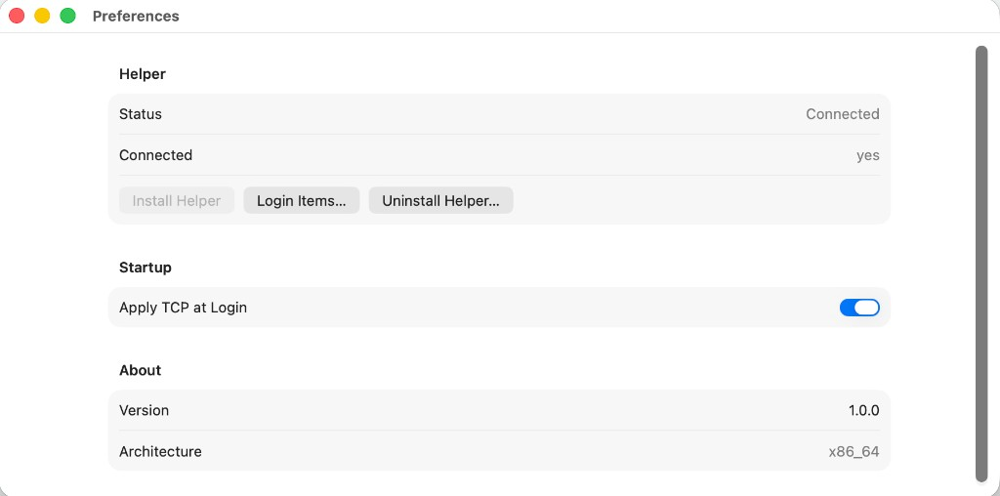
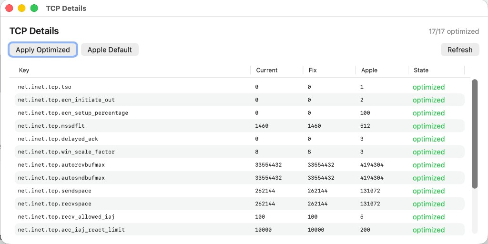
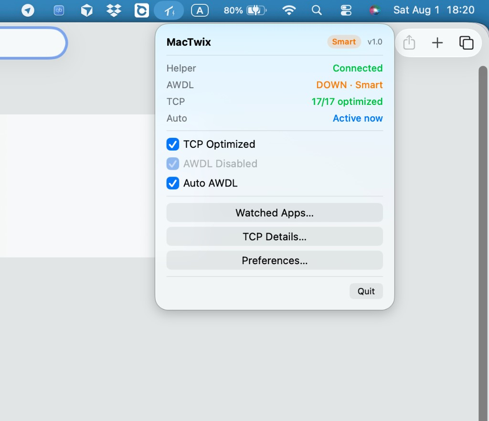

<p align="center">
  
</p>

<h1 align="center">MacTwix</h1>

<p align="center">
  <b>macOS network tweak utility</b><br>
  One-click TCP optimization, AWDL control, and smart auto-mode — all from the menubar.
</p>

<p align="center">
  
  
  
</p>

---

## What it does

MacTwix is a lightweight menubar app that applies network-level optimizations to macOS without requiring repeated password prompts. Think of it as **GNOME Tweaks, but for macOS networking**.

- **TCP Stack Optimization** — applies 17 sysctl knobs (buffer sizes, ECN, TSO, delayed ACK, CUBIC tuning) for better throughput and lower latency
- **AWDL Control** — disable the hidden `awdl0` interface that causes Wi-Fi interference (AirDrop/Handoff uses it)
- **Smart Auto Mode** — automatically disables AWDL when torrent clients (or any configured app) are running, re-enables when they quit
- **Persistent** — privileged helper runs at boot, no password needed after one-time setup
- **Universal Binary** — single app works on both Intel and Apple Silicon Macs

## Screenshots

| Menubar popover | TCP Details | Preferences |
|:---:|:---:|:---:|
|  |  |  |

## Install

### Option A: Download DMG

1. Download `MacTwix.dmg` from [Releases](../../releases)
2. Drag `MacTwix.app` to `/Applications`
3. Open MacTwix — click the **T** icon in menubar
4. Click the warning banner → **Install Helper**
5. Approve in **System Settings → General → Login Items**

> **Note:** Gatekeeper will warn about unsigned builds. Right-click → Open to bypass, or build from source.

### Option B: Build from source (recommended)

```bash
brew install xcodegen
git clone https://github.com/webgkv/mactwix.git
cd mactwix
xcodegen generate
open MacTwix.xcodeproj
```

1. Xcode → **Settings → Accounts** → add your Apple ID (free is fine)
2. Select target **MacTwix** → Signing & Capabilities → Team → your **Personal Team**
3. Repeat for target **MacTwixHelper**
4. **⌘R** to build & run

Optional: put your Team ID in `Config/Local.xcconfig` (gitignored):
```
DEVELOPMENT_TEAM = YOURTEAMID
```

## How it works

```
┌─────────────┐         XPC          ┌──────────────────┐
│  MacTwix    │◄─────────────────────►│  MacTwixHelper   │
│  (menubar)  │    Mach service       │  (root daemon)   │
│  user-space │                       │  LaunchDaemon    │
└─────────────┘                       └──────────────────┘
                                             │
                                      ┌──────┴──────┐
                                      │ sysctl      │
                                      │ ifconfig    │
                                      │ pmset       │
                                      │ lsappinfo   │
                                      └─────────────┘
```

- **One-time privilege escalation** via `SMAppService` — no repeated password prompts
- Helper persists across reboots (`KeepAlive` LaunchDaemon)
- AWDL Watchdog re-disables `awdl0` every ~2.5s if macOS re-enables it (common on Apple Silicon)
- App auto-launches at login for tray icon visibility

## Features

| Feature | Description |
|---------|-------------|
| TCP Optimized | Apply/rollback 17 sysctl parameters |
| AWDL Disabled | Manual awdl0 down/up |
| Auto AWDL (Smart) | Monitor apps → disable AWDL when trigger app is running |
| Watched Apps | Configurable list + "Torrents Apps" preset (12 clients) |
| Apply at Login | Re-apply TCP optimizations on every boot |
| Uninstall | Full rollback: TCP defaults, AWDL up, daemon removed |
| Agent Debug API | `localhost:18765` — real-time status for AI/automation |

## Compatibility

| Platform | AWDL | TCP | Auto | Watchdog |
|----------|:----:|:---:|:----:|:--------:|
| Intel Mac | ✅ | ✅ | ✅ | — |
| Apple Silicon | ✅ | ✅ | ✅ | ✅ |

## Project layout

```
mactwix/
├── MacTwix/              # SwiftUI menubar app
│   ├── AppModel.swift    # State management + helper communication
│   ├── MenuView.swift    # Popover UI
│   ├── WatchedAppsView   # Trigger apps config window
│   ├── TCPDetailsView    # Per-knob TCP table
│   ├── PreferencesView   # Helper install/uninstall, settings
│   ├── DeveloperView     # Agent API info (hidden, 7-tap on version)
│   ├── AgentDebugServer  # localhost HTTP API
│   └── AgentLog          # Ring-buffer logger
├── MacTwixHelper/        # Privileged root daemon
│   ├── HelperXPC         # XPC service + client auth
│   ├── NetworkOps        # sysctl, ifconfig, pmset operations
│   ├── AutoModeEngine    # App-watching + AWDL toggle
│   └── AWDLWatchdog      # Periodic AWDL re-assert
├── Shared/               # Protocol, FixValues, TriggerCatalog
├── Config/               # xcconfig files
├── Assets/               # SVG icons
├── scripts/              # CLI fallback (reference)
├── doc/                  # CONCEPT.md, AGENT_API.md
└── project.yml           # XcodeGen spec
```

## Agent Debug API

While MacTwix is running, monitor state in real-time:

```bash
# Health check
curl http://127.0.0.1:18765/health

# Full status JSON
curl http://127.0.0.1:18765/status

# Recent logs
curl http://127.0.0.1:18765/logs?limit=50

# File paths
curl http://127.0.0.1:18765/paths
```

Or tail the log file:
```bash
tail -f ~/Library/Logs/MacTwix/agent.log
```

See [doc/AGENT_API.md](doc/AGENT_API.md) for full documentation.

## CLI scripts (fallback)

The original shell scripts are kept as reference/emergency fallback:

```bash
sudo ./scripts/fix-tcp-tahoe.sh --install
sudo ./scripts/fix-wifi-tahoe.sh --install
./scripts/fix-tcp-tahoe.sh --status
```

Prefer the app once the helper is installed.

## License

This project is licensed under the **GNU General Public License v3.0** — see [LICENSE](LICENSE) for details.

**TL;DR:** Free to use, modify, and distribute. Forks must remain open-source under the same license. Attribution to the original author is required.

For commercial licensing (use without GPL obligations), contact the author.

---

## Support

If you find MacTwix useful and want to support development or say thanks, donations are welcome:

| Network | Address |
|---------|---------|
| Bitcoin (BTC) | `bc1q0gyk6e77c2pxq7csjedk9v7wxl3du3wr3s7jp6` |
| Ethereum (ETH / ERC-20) | `0xBe8188DaB4b908d626CfbAC58A0B91F1c521E634` |
| USDT (TRC-20) | `TVAMSfenXAwdpUM2fkujpVtFqBXxecMQCe` |
| TON | `UQBrALwkTwL5mU9B88YCw1WX87HwEqArWkvpDEqXc3efgThF` |
| Solana (SOL) | `B1iGj1xRPw1f8o9txqbMnbWDZvVcp3ah2chjD8pSokQT` |
